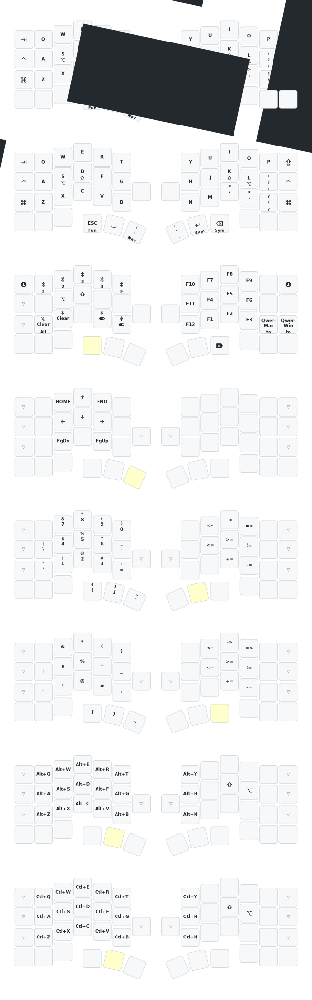

> [!IMPORTANT]
>
> **Please use the [Online ZMK Editor](https://nickcoutsos.github.io/keymap-editor) to build firmware with GitHub actions.**

> [!IMPORTANT]
>
> **For macOS, please swap "Command" and "Option" in keyboard settings.**

## Build

- Use `mise i` to install python3.
- Run `python3 -m venv venv` to create local virtual python3 environment.
- Run `source ./venv/bin/active` to active virtual python3 environment.
- Run `pip3 install --user -U west` on Linux, or `pip3 install -U west` on Windows/Mac.

## Acknowledgement

- Reference: [hitsmaxft/zmk-keyboard-cornix](https://github.com/hitsmaxft/zmk-keyboard-cornix).
- ZMK keymap edited by [nickcoutsos/keymap-editor](https://github.com/nickcoutsos/keymap-editor).
- Keymap image generated by [caksoylar/keymap-drawer](https://github.com/caksoylar/keymap-drawer).
- Keyboard icons picked from [material design icons](https://pictogrammers.com/library/mdi/).
